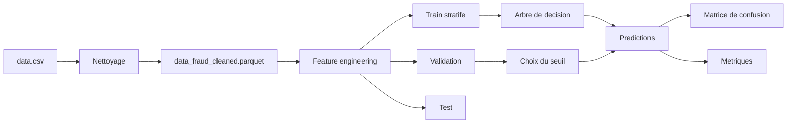

# Rapport de detection de fraude

## Resume

- Lignes analysees: 6 362 620
- Lignes retenues apres reduction: 50 000
- Variables apres nettoyage / enrichissement: 30
- Fraudes: 8 213
- Taux de fraude: 16.4260%
- Seuil arbre de decision: 0.80
- Seuil regression logistique: 0.60
- Seuil Naive Bayes gaussien: 0.90

## Nettoyage

- Aucune valeur manquante detectee dans le dataset source.
- Colonnes textuelles identifiantes retirees du modele: `nameOrig`  `nameDest`.
- Variables derivees ajoutees: indicateurs de type  soldes nuls  compte origine vide apres transaction  incoherences de solde  ratios et logarithmes.
- Variables interdites au modele pour eviter la fuite d'information: `newbalanceOrig`  `newbalanceDest`  `isFlaggedFraud` et toutes les variables derivees apres transaction.
- Variables numeriques du modele centrees-reduites apres clipping `q01-q99` calcule sur le train uniquement.
- Jeu nettoye exporte dans: `outputs/data_fraud_cleaned.parquet`
- Jeu reduit pour l'entrainement exporte dans: `outputs/data_fraud_reduced_50000.parquet`
- Jeu reduit centre-reduit exporte dans: `outputs/data_fraud_reduced_50000_scaled.parquet`

## Protocole anti fuite

- Entrainement: `step <= 379` avec 40 270 lignes et 4 223 fraudes.
- Validation: `379 < step <= 478` avec 4 744 lignes et 1 116 fraudes.
- Test: `step > 478` avec 4 986 lignes et 2 874 fraudes.
- Le modele n'utilise que des variables disponibles avant ou au debut de la transaction.

## Schema

## Comparaison des modeles

| Modele | Accuracy test | Precision test | Recall test | F1 test | Balanced accuracy test |
|---|---:|---:|---:|---:|---:|
| Arbre de decision | 89.5106% | 93.9111% | 87.4739% | 90.5783% | 89.8781% |
| Regression logistique | 85.6398% | 95.4507% | 78.8448% | 86.3567% | 86.8656% |
| Naive Bayes gaussien | 88.8087% | 84.4438% | 98.7822% | 91.0520% | 87.0095% |

## Metriques validation arbre

| Metrique | Valeur |
|---|---:|
| Accuracy | 90.9781% |
| Precision | 77.4322% |
| Recall | 87.0072% |
| Specificity | 92.1996% |
| F1 | 81.9409% |
| Balanced accuracy | 89.6034% |

## Matrice de confusion test arbre

| Metrique | Valeur |
|---|---:|
| TN | 1 949 |
| FP | 163 |
| FN | 360 |
| TP | 2 514 |

## Metriques test arbre

| Metrique | Valeur |
|---|---:|
| Accuracy | 89.5106% |
| Precision | 93.9111% |
| Recall | 87.4739% |
| Specificity | 92.2822% |
| F1 | 90.5783% |
| Balanced accuracy | 89.8781% |

## Metriques validation regression logistique

| Metrique | Valeur |
|---|---:|
| Accuracy | 91.8634% |
| Precision | 84.0485% |
| Recall | 80.7348% |
| Specificity | 95.2867% |
| F1 | 82.3583% |
| Balanced accuracy | 88.0107% |

## Matrice de confusion test regression logistique

| Metrique | Valeur |
|---|---:|
| TN | 2 004 |
| FP | 108 |
| FN | 608 |
| TP | 2 266 |

## Metriques test regression logistique

| Metrique | Valeur |
|---|---:|
| Accuracy | 85.6398% |
| Precision | 95.4507% |
| Recall | 78.8448% |
| Specificity | 94.8864% |
| F1 | 86.3567% |
| Balanced accuracy | 86.8656% |

## Matrice de confusion test Naive Bayes gaussien

| Metrique | Valeur |
|---|---:|
| TN | 1 589 |
| FP | 523 |
| FN | 35 |
| TP | 2 839 |

## Metriques test Naive Bayes gaussien

| Metrique | Valeur |
|---|---:|
| Accuracy | 88.8087% |
| Precision | 84.4438% |
| Recall | 98.7822% |
| Specificity | 75.2367% |
| F1 | 91.0520% |
| Balanced accuracy | 87.0095% |

## Fraude par type

| Type | Normal | Fraude |
|---|---:|---:|
| CASH_IN | 9 134 | 0 |
| CASH_OUT | 14 791 | 4 116 |
| DEBIT | 271 | 0 |
| PAYMENT | 14 102 | 0 |
| TRANSFER | 3 489 | 4 097 |

## Structure du modele

- Si `is_payment <= 0.5000` (n=5197  fraude=4223)
  - Si `is_cash_in <= 0.5000` (n=4886  fraude=4223)
    - Si `orig_zero <= 0.5000` (n=4664  fraude=4223)
      - Si `oldbalanceOrg <= -0.3147` (n=4438  fraude=4195)
        - Feuille: taux_fraude=0.7773  echantillons=777  fraudes=604
      - Sinon
        - Feuille: taux_fraude=0.9809  echantillons=3661  fraudes=3591
    - Sinon
      - Feuille: taux_fraude=0.1239  echantillons=226  fraudes=28
  - Sinon
    - Feuille: taux_fraude=0.0000  echantillons=222  fraudes=0
- Sinon
  - Feuille: taux_fraude=0.0000  echantillons=311  fraudes=0

## Coefficients regression logistique

| Variable | Poids |
|---|---:|
| is_transfer | 0.853623 |
| is_cash_out | 0.352295 |
| is_payment | -1.016812 |
| is_debit | -0.023058 |
| is_cash_in | -1.063380 |
| orig_zero | -0.650917 |
| dest_zero | 0.321565 |
| step | -0.197898 |
| amount | 0.559163 |
| oldbalanceOrg | -0.461232 |
| oldbalanceDest | -0.339926 |
| amount_log | 0.331011 |
| oldbalanceOrg_log | 1.112357 |
| bias | -0.901723 |

## Centrage reduction

| Variable | Clip bas | Clip haut | Moyenne train | Ecart-type train |
|---|---:|---:|---:|---:|
| step | 9.0000 | 378.0000 | 204.9029 | 111.0102 |
| amount | 457.4100 | 5239429.1900 | 273644.9367 | 683952.0915 |
| oldbalanceOrg | 0.0000 | 15857536.1300 | 841343.2888 | 2495821.5575 |
| oldbalanceDest | 0.0000 | 11644938.0200 | 920173.3601 | 1961377.4545 |
| amount_log | 6.1278 | 15.4717 | 11.0540 | 1.8886 |
| oldbalanceOrg_log | 0.0000 | 16.5792 | 7.9452 | 5.6671 |

## Fichiers generes

- `outputs/fraud_report.md`
- `outputs/fraud_tree.json`
- `outputs/fraud_logistic.json`
- `outputs/fraud_gaussian_nb.json`
- `outputs/metrics.json`
- `outputs/confusion_matrix.csv`
- `outputs/class_distribution.svg`
- `outputs/fraud_by_type.svg`
- `outputs/confusion_matrix.svg`
- `outputs/fraud_rate_by_type.svg`
- `outputs/fraud_rate_by_period.svg`
- `outputs/fraud_rate_by_amount_bucket.svg`
- `outputs/fraud_signal_comparison.svg`
